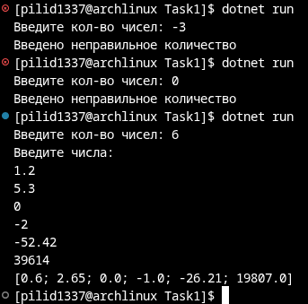
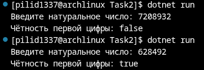
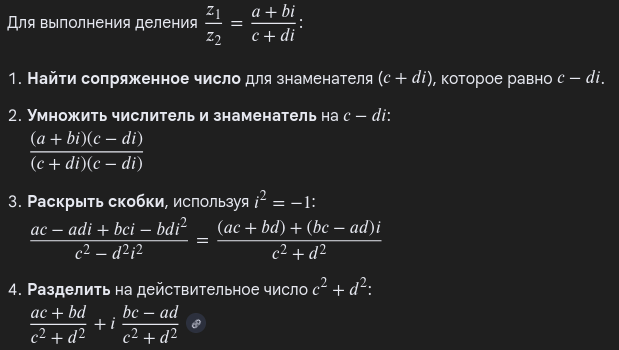
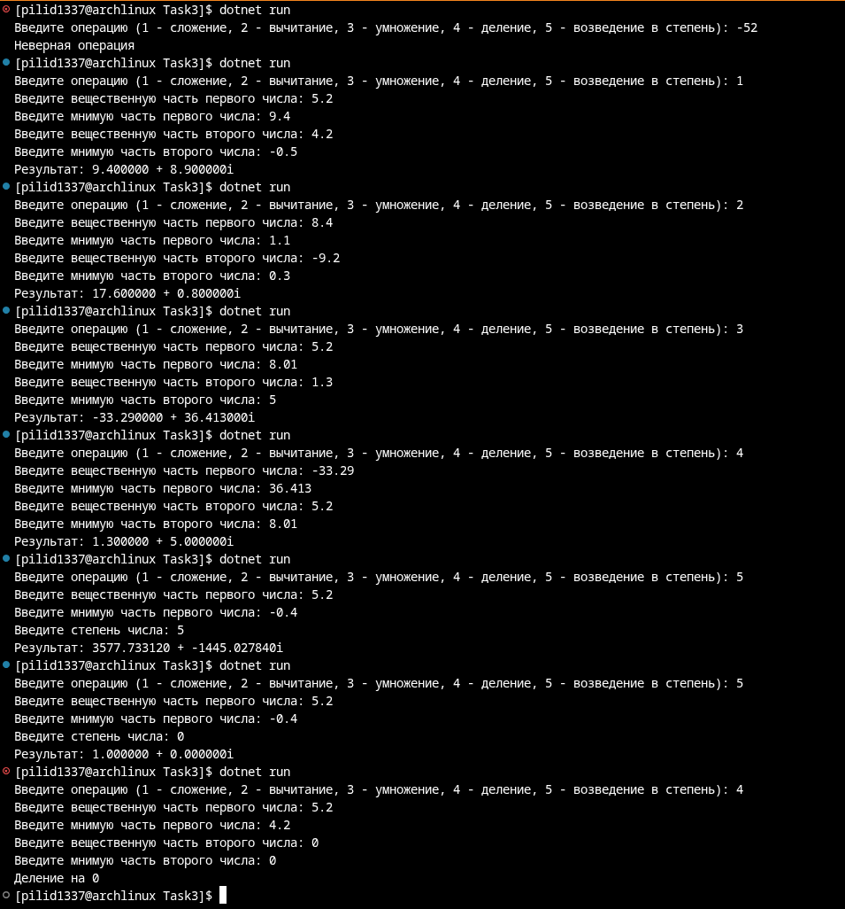

# Абдульманов Алмаз КМБ-1 Лабораторная №0

# Задание 1

## Задача 13

### Текст задачи

Сформировать список из чисел, в 2 раза меньших, чем вводимые значения

### Алгоритм решения

Считать список, разделить его значения на 2, вывести

### Тестирование

# Задание 2

## Задача 13

### Текст задачи

Для данного натурального возвратить true, если первая цифра чётная, и false — в противном
случае.

### Алгоритм решения

Рекурсивно делить число, пока оно не станет меньше 10. Чётность этого числа и есть чётность первой цифры

### Тестирование

# Задание 3

## Задача 1

### Текст задачи

Опишите функции, осуществляющие основные математические операции над комплексными
числами (сложение, вычитание, умножение, деление, возведение в степень). Использовать
готовый класс Complex запрещено.

### Алгоритм решения

Сумма мнимых чисел является суммой вещественной и мнимой частей соответственно

Разность мнимых чисел является разностью вещественной и мнимой частей соответственно

Произведение мнимых чисел можно представить как (a + Ai) * (b + Bi) = a * b  +  A * B * i * i  +  i * (a * B + b * A) = (a * b  -  A * B)  + i * (a * B + b * A)

Частное не объяснит никто лучше, чем Google

Возведение в степень реализовано как рекурсивное произведение числа самого на себя до тех пор, пока не будет достигнута степень 1 ИЛИ 1 при степени 0

Программа принимает на вход код операции, число и если необходимо, то ещё степень или второе число. После выполняет выбранную операцию с введёнными данными.

### Тестирование

*Примечание: все ответы были честно проверены через mathway*

